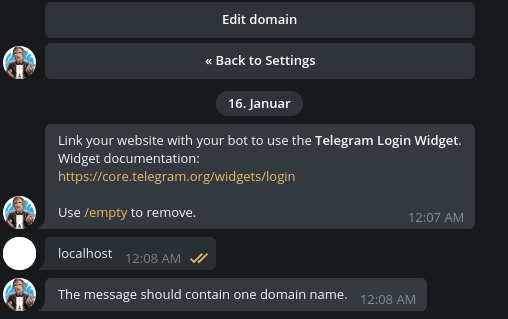

# passport-telegram-widget

[Passport](https://passportjs.org) strategy for [Telegram login widget](https://core.telegram.org/widgets/login) authentication.

## Install

```bash
npm i passport-telegram-widget
```

## Setup

### Bot
You need a Telegram bot for the login widget to work. Please follow their official instructions on how to set up the bot and generate the `<script>` tag on https://core.telegram.org/widgets/login


## Usage


### Locally

For the bot to send user data to your site (`data-auth-url`), you have to enable your domain. This doesn't work with localhost.



Luckily, we have `/etc/hosts`, which we can use to make browsers believe that they are talking to a domain; e.g. `my-app.me`.

*Windows users will find the hosts file at `C:\Windows\System32\drivers\etc\hosts`*

Open `/etc/hosts` with an editor (root privileges required!) and add `my-app.me` to the line starting with `127.0.0.1`

`127.0.0.1 localhost my-app.me`

Now change the generated markup, setting `data-auth-url`

```html
<script
  async
  src="https://telegram.org/js/telegram-widget.js?15"
  data-telegram-login="my_app_me_bot"
  data-size="large"
  data-auth-url="http://my-app.me/tg-auth">
</script>
```

The path `tg-auth` is from the [demo implementation](https://github.com/rbeer/passport-telegram-widget-demo.git) to this strategy. You will want to adjust that for yours.

Go back to the @botfather and `/setdomain` on your bot


Now you can spin up your server and log in via http://my-app.me/, using the widget.

*P.S. This `hosts` trick works great for all sorts of other domain-related headaches, like CORS and SSL*
